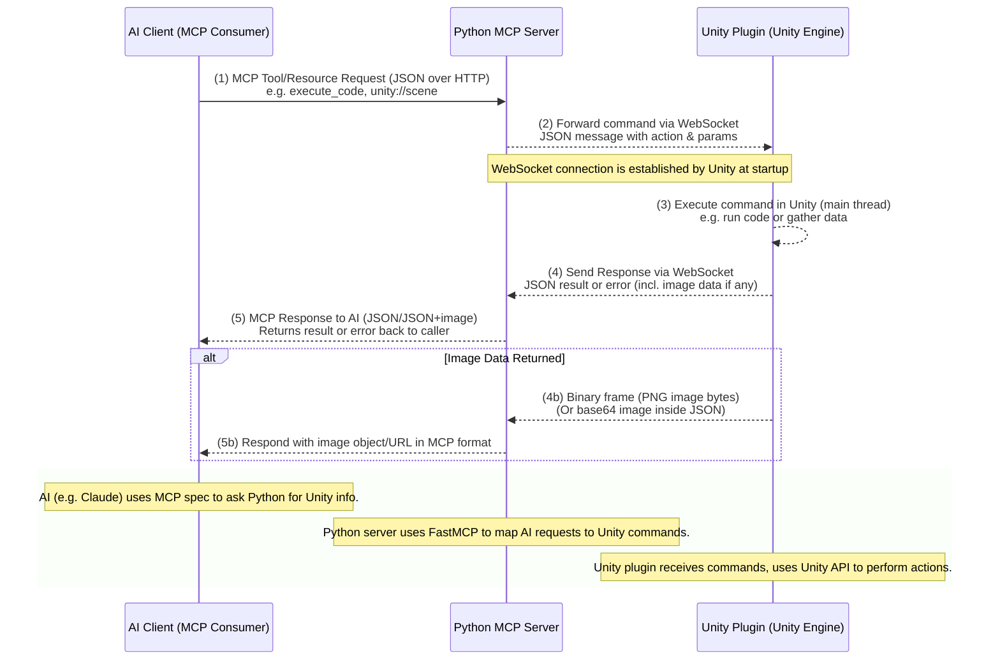

# YetAnotherUnityMcp - Technical Details

## System Architecture 

The architecture is organized into two main processes (Unity and Python), each internally modular, following best practices of their ecosystem:

### Unity Plugin Structure

The Unity side is implemented as a typical Unity plugin with separate editor code. All functionality resides in the **Editor** scripts, which are only used in the Unity Editor. The core components on the Unity side are:

1. **MCPConnection**: A static class that manages connection to the MCP server via WebSockets.
2. **WebSocketClient**: Handles low-level WebSocket communication.
3. **MCPWebSocketManager**: Manages the WebSocket client and provides high-level API for communication.
4. **Command Classes**: Individual command implementations for each functionality (ExecuteCode, TakeScreenshot, etc.).
5. **MCPWindow and WebSocketMCPWindow**: Editor windows for testing and debugging.

### Python MCP Server Structure

The Python server uses the FastMCP framework to define the available actions and data endpoints in an organized way. Key components include:

1. **mcp_server.py**: The main MCP server implementation using FastMCP.
2. **websocket_mcp_server.py**: The WebSocket-based MCP server.
3. **models/unity.py**: Data models for Unity objects.
4. **api/handlers.py**: API endpoints for the traditional HTTP server.

The server can run in two modes:
- **MCP mode**: Using FastMCP's built-in server (via `fastmcp run` or an MCP-enabled FastAPI app).
- **WebSocket mode**: A dedicated WebSocket server for real-time communication.

## Communication Protocol (WebSockets & JSON)

All communication between the Unity plugin and the Python server uses a **WebSocket** connection, which allows persistent, low-latency bidirectional messaging. This avoids constant polling and enables the server to push commands to Unity instantly whenever an AI makes a request.

### Message Format

Every message is a JSON object containing at least a **message type**, a **unique ID** (to pair requests with responses), and a **payload**. We define two primary message types:

#### Request

Sent from the Python server to Unity to command an action or query data. It contains an `action` (or resource identifier) and any parameters needed. For example: 

```json
{
  "id": "req-101",
  "type": "request",
  "action": "execute_code",
  "payload": {
    "code": "Debug.Log(\"Hello from AI\");"
  }
}
```

This asks Unity to execute a snippet of C# code. Another example could be a resource query: 

```json
{
  "id": "req-102",
  "type": "request",
  "action": "unity://scene/Level1",
  "payload": {}
}
```

#### Response

Sent from Unity back to the server as a reply to a request. It echoes the same `id` and contains either a result or an error. For a successful response, we use `status: "success"` and include the `result` data. For errors, `status: "error"` and an `error` message field are used.

```json
{
  "id": "req-101",
  "type": "response",
  "status": "success",
  "result": {
    "output": "Hello from AI", 
    "logs": ["Hello from AI"], 
    "returnValue": null
  }
}
```

For errors:

```json
{
  "id": "req-101",
  "type": "response",
  "status": "error",
  "error": "NullReferenceException at line 1 ..."
}
```

### Image Data

For commands that produce image data (such as a screenshot capture tool), the Unity plugin can transmit images using base64 encoding within JSON:

```json
{
  "id": "req-103",
  "type": "response",
  "status": "success",
  "result": {
    "image": "<base64-encoded-data>",
    "format": "png",
    "width": 1280,
    "height": 720
  }
}
```

### Supported Messages (Tools & Resources)

By default, the system defines a set of actions that the Unity plugin will recognize and handle:

#### Tools (actions Unity can perform)

- `execute_code`: Execute an arbitrary C# code snippet in the Unity environment.
- `screen_shot_editor`: Capture a screenshot of the current Unity Editor view.
- `modify_object`: Modify properties of a Unity GameObject.

#### Resources (data Unity can provide)

- `unity://info`: General information about the Unity environment.
- `unity://logs`: Recent Unity console logs.
- `unity://scene/{sceneName}`: Detailed information about a scene.
- `unity://object/{objectId}`: Detailed information about a specific object.

## WebSocket Implementation Details

The WebSocket implementation has the following components:

1. **WebSocketClient**: Low-level client that handles WebSocket connection, message sending/receiving, and disconnection. It uses .NET's `ClientWebSocket` class, which is part of the standard library.

2. **MCPWebSocketManager**: Manages the WebSocket client and provides higher-level API:
   - Automatic JSON serialization/deserialization
   - Request-response mapping using unique IDs
   - Timeout handling for requests
   - Async/await interface for Unity

3. **MCPConnection**: A static class that provides the main interface for the plugin:
   - Automatically converts HTTP URLs to WebSocket URLs
   - Provides fallback to local command execution when disconnected
   - Exposes simple methods for each supported command

## Error Handling & Fallbacks

The system is designed to handle errors gracefully:

1. **Connection Errors**: The WebSocket client attempts to reconnect if the connection is lost. The MCPConnection class provides feedback through events that the UI can subscribe to.

2. **Message Timeouts**: If a request doesn't receive a response within a configurable time, it will throw a timeout exception that the caller can handle.

3. **Local Fallback**: When not connected to a server, the MCPConnection can execute commands locally using the Command classes. This ensures that the plugin can still be used even without a server.

4. **JSON Validation**: All messages are validated for proper format and content. Invalid messages are rejected with appropriate error responses.

## Extensibility

The system is designed to be extensible:

1. **Adding New Commands**: To add a new command, you need to:
   - Add a new Command class in the Editor/Commands folder
   - Implement the command logic
   - Add handling in the MCPConnection class
   - Add handling in the Python server

2. **Adding New Resources**: Similar to commands, new resources require implementation on both sides.

3. **Custom Message Types**: The protocol can be extended with new message types if needed.

## Architecture Diagram

The following diagram illustrates the components of the system and the communication flow between them:



In this workflow:
1. The AI client sends a request to the Python MCP server.
2. The Python server forwards the command to Unity via WebSocket.
3. Unity executes the command on the main thread.
4. Unity sends the response back to the Python server via WebSocket.
5. The Python server formats the response and sends it back to the AI client.

This architecture ensures clean separation of concerns and allows for real-time communication between Unity and the AI client.