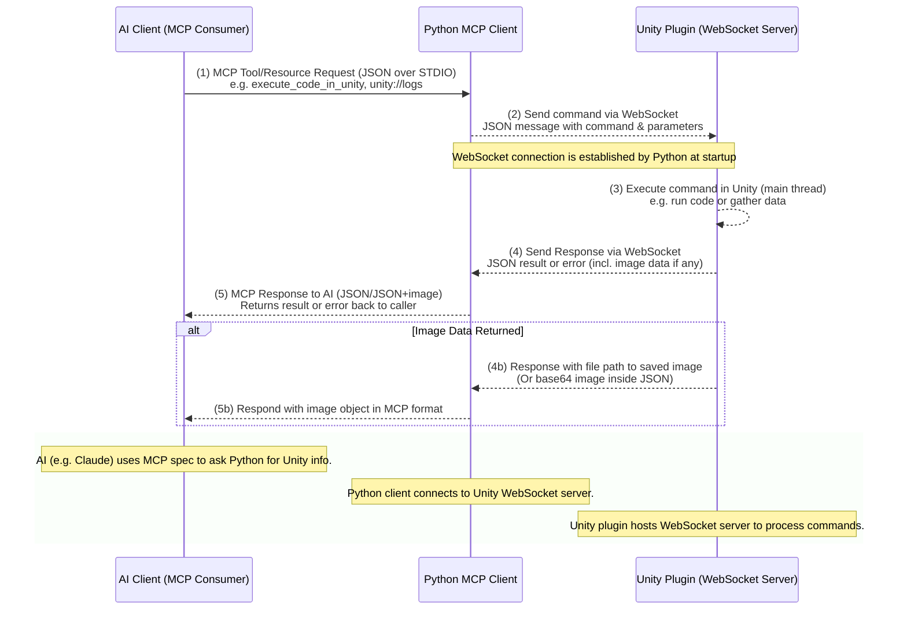

# YetAnotherUnityMcp - Technical Details

## System Architecture 

The architecture is organized into two main processes (Unity and Python), each internally modular, following best practices of their ecosystem. The key difference from traditional MCP setups is that Unity acts as the WebSocket server rather than the client.

### Unity Server Structure

The Unity side is implemented as a typical Unity plugin with separate editor code. All functionality resides in the **Editor** scripts, which are only used in the Unity Editor. The core components on the Unity side are:

1. **WebSocketServer**: Manages WebSocket connections, provides events for connection management, and message routing.
2. **MCPWebSocketServer**: High-level manager for the WebSocket server with MCP-specific functionality.
3. **WebSocketServerMCPWindow**: Editor window for managing and monitoring the server.
4. **Command Classes**: Individual command implementations for each functionality (ExecuteCode, TakeScreenshot, etc.).
5. **WebSocketMessages**: Message types for handling communication (requests, responses, errors).
6. **MCPRegistry**: Registry for tools and resources with schema information.
7. **MCPToolSchema**: Schema models for tools and resources (ToolDescriptor, ResourceDescriptor, etc.).

### Python Client Structure

The Python client uses the FastMCP framework to define the available actions and data endpoints in an organized way. Key components include:

1. **mcp_server.py**: The main MCP server implementation using FastMCP with lifespan management.
2. **unity_websocket_client.py**: The high-level client for communicating with Unity.
3. **websocket_client.py**: The low-level WebSocket client implementation.
4. **mcp/unity_client_util.py**: Utility functions for standardized client operations.
5. **mcp/tools/**: Tool implementations for MCP with unified execution pattern.
   - **mcp/tools/get_schema.py**: Tool for retrieving available tools and resources information
   - **mcp/tools/execute_code.py**: Tool for executing C# code in Unity
   - **mcp/tools/take_screenshot.py**: Tool for capturing Unity screenshots
   - And others...
6. **mcp/resources/**: Resource implementations for MCP with standardized error handling.

The client can run in two modes:
- **MCP mode**: Using FastMCP's built-in server with STDIO transport (via `fastmcp run` or an MCP-enabled FastAPI app).
- **Direct mode**: A direct WebSocket client connection to Unity for testing and development.

## Communication Protocol (WebSockets & JSON)

All communication between the Unity server and the Python client uses a **WebSocket** connection, which allows persistent, low-latency bidirectional messaging. This avoids constant polling and enables real-time communication between Unity and Python.

### Message Format

Every message is a JSON object containing at least a **command or response type**, a **unique ID** (to pair requests with responses), and **parameters or result object**. We define two primary message types:

#### Command Request

Sent from the Python client to Unity to request an action. It contains a `command` name and any parameters needed. For example: 

```json
{
  "id": "req_101",
  "command": "execute_code",
  "parameters": {
    "code": "Debug.Log(\"Hello from AI\");"
  },
  "client_timestamp": 1710956378123
}
```

This asks Unity to execute a snippet of C# code.

#### Command Response

Sent from Unity back to the client as a reply to a request. It echoes the same `id` and contains either a result or an error. For a successful response, we use `status: "success"` and include the `result` data. For errors, `status: "error"` and an `error` message field are used.

```json
{
  "id": "req_101",
  "type": "response",
  "status": "success",
  "result": {
    "output": "Hello from AI", 
    "logs": ["Hello from AI"], 
    "returnValue": null
  },
  "server_timestamp": 1710956378456,
  "client_timestamp": 1710956378123
}
```

For errors:

```json
{
  "id": "req_101",
  "type": "response",
  "status": "error",
  "error": "NullReferenceException at line 1 ...",
  "server_timestamp": 1710956378456,
  "client_timestamp": 1710956378123
}
```

### Image Data

For commands that produce image data (such as a screenshot capture tool), the Unity server can transmit images using file paths or base64 encoding within JSON:

```json
{
  "id": "req_103",
  "type": "response",
  "status": "success",
  "result": {
    "filePath": "/path/to/screenshot.png",
    "width": 1280,
    "height": 720
  },
  "server_timestamp": 1710956379456,
  "client_timestamp": 1710956379123
}
```

### Supported Commands

By default, the system defines a set of commands that the Unity server will recognize and handle:

- `execute_code`: Execute an arbitrary C# code snippet in the Unity environment.
- `take_screenshot`: Capture a screenshot of the current Unity Editor view.
- `modify_object`: Modify properties of a Unity GameObject.
- `get_logs`: Get recent Unity console logs.
- `get_unity_info`: Get information about the Unity environment.
- `get_schema`: Retrieve information about all available tools and resources.

## WebSocket Implementation Details

### Unity WebSocket Server

The Unity WebSocket server has the following components:

1. **WebSocketServer**: Core server implementation that handles:
   - Managing client connections
   - Message routing
   - Thread-safe message queue for processing on the main thread
   - Performance monitoring
   - Error handling and logging

2. **MCPWebSocketServer**: High-level manager that provides:
   - Command processing for MCP tools
   - JSON serialization/deserialization
   - Client tracking with connection information
   - Logging and monitoring functions
   - Interface for other Unity scripts to use

3. **WebSocketServerMCPWindow**: Editor window that provides:
   - Server controls (start/stop)
   - Connected client list
   - Message log for debugging
   - Status information

### Python WebSocket Client

The Python client implementation includes:

1. **WebSocketClient**: Low-level client that handles:
   - Connection to Unity server
   - Message sending/receiving
   - Request-response tracking with IDs
   - Event-based communication (connected, disconnected, message, error)
   - Async/await interface for Python

2. **UnityWebSocketClient**: High-level client that provides:
   - Higher-level APIs for Unity commands (execute_code, take_screenshot, etc.)
   - Callback registration for status events
   - Error handling and logging

3. **unity_client_util**: Utility module that provides:
   - Standardized execution pattern for all operations
   - Automatic reconnection attempts
   - Consistent error handling and formatting
   - Context integration with FastMCP

## Error Handling & Security

The system is designed to handle errors gracefully and maintain security:

1. **Connection Handling**: Both server and client handle connection errors gracefully with appropriate logging and notifications.

2. **Message Validation**: All messages are validated for proper format and content.

3. **Thread Safety**: The Unity server processes all WebSocket messages on the main Unity thread to ensure thread safety.

4. **Timeout Handling**: Command execution has timeouts to prevent hanging operations.

5. **Connection Monitoring**: Performance metrics are tracked and logged for monitoring connection health.

## Schema System

The system includes a schema retrieval mechanism that provides self-documentation of available tools and resources. This allows clients to discover what operations are available without hardcoding knowledge of the API.

### Schema Structure

The schema information is organized as follows:

```json
{
  "tools": [
    {
      "name": "execute_code",
      "description": "Execute C# code in Unity",
      "inputSchema": {
        "type": "object",
        "properties": {
          "code": {
            "type": "string",
            "description": "C# code to execute",
            "required": true
          }
        },
        "required": ["code"]
      },
      "outputSchema": {
        "type": "object",
        "properties": {
          "output": {
            "type": "string",
            "description": "String representation of the return value",
            "required": true
          },
          "logs": {
            "type": "array",
            "description": "Array of log messages generated during execution",
            "required": true
          },
          "returnValue": {
            "type": "object",
            "description": "The actual return value (if serializable)",
            "required": false
          }
        }
      },
      "example": "execute_code(\"Debug.Log(\\\"Hello from AI\\\"); return 42;\")"
    }
  ],
  "resources": [
    {
      "name": "unity_info",
      "description": "Get information about the Unity environment",
      "urlPattern": "unity://info",
      "outputSchema": {
        "type": "object",
        "properties": {
          "unityVersion": {
            "type": "string",
            "description": "Version of Unity Editor",
            "required": true
          },
          "platform": {
            "type": "string",
            "description": "Platform the Unity Editor is running on",
            "required": true
          },
          "isPlaying": {
            "type": "boolean",
            "description": "Whether the Unity Editor is in play mode",
            "required": true
          },
          "activeScenes": {
            "type": "array",
            "description": "List of active scene names",
            "required": true
          }
        }
      },
      "example": "unity://info"
    }
  ]
}
```

### Schema Registration and Discovery

The schema system uses C# attributes for automatic schema generation. This allows for a more maintainable and type-safe approach to schema definition. The key components are:

1. **Attribute-Based Schema Definition**:
   - `MCPToolAttribute`: Marks a class as an MCP tool with name, description, and example
   - `MCPResourceAttribute`: Marks a class as an MCP resource with name, description, URL pattern, and example
   - `MCPSchemaAttribute`: Marks nested classes as input or output schemas
   - `MCPParameterAttribute`: Defines parameters for inputs and outputs with type information

2. **Introspection**:
   The `MCPAttributeUtil` class provides methods to extract schema information from attributed classes through reflection:
   - `CreateToolDescriptorFromType`: Creates a tool descriptor from a class with attributes
   - `CreateResourceDescriptorFromType`: Creates a resource descriptor from a class with attributes
   - `GetSchemaFromType`: Extracts schema information from input/output model classes

3. **Registration**:
   Tools and resources are registered in the Unity `MCPRegistry` class, which maintains a singleton instance with all available operations. The registration happens automatically using reflection on attributed classes.

4. **Name Inference**:
   When the `name` parameter of an attribute is set to `null`, the system automatically infers the name by:
   - Converting the class or member name from CamelCase to snake_case
   - Removing suffix words like "Command" or "Resource" 
   - For example: `TakeScreenshotCommand` → `take_screenshot`

5. **Testing**:
   The schema system is thoroughly tested using NUnit tests in the Unity Test Framework:
   - `MCPAttributeUtilTests`: Tests for the core schema generation functions
     - `ConvertCamelCaseToSnakeCase_ReturnsCorrectResults`: Tests the name inference algorithm
     - `GetTypeString_ReturnsCorrectTypeStrings`: Tests C# type conversion to schema types
     - `CreateToolDescriptorFromCommandType_WithExplicitName_ReturnsCorrectDescriptor`: Tests explicit name schema generation
     - `CreateToolDescriptorFromCommandType_WithInferredName_ReturnsCorrectDescriptor`: Tests name inference
     - Tests for complex output schema generation from different return types
   - `MCPRegistryTests`: Tests for the schema registration system
   - `GetSchemaCommandTests`: Integration tests for the entire schema retrieval pipeline

#### Example: Attribute-Based Command Definition

```csharp
/// <summary>
/// Command to execute C# code at runtime in the Unity Editor
/// </summary>
[MCPTool("execute_code", "Execute C# code in Unity", "execute_code(\"Debug.Log(\\\"Hello\\\"); return 42;\")")]
public static class ExecuteCodeCommand
{
    /// <summary>
    /// Execute C# code in the Unity Editor
    /// </summary>
    /// <param name="code">The C# code to execute</param>
    /// <returns>Result of the execution</returns>
    public static string Execute(
        [MCPParameter("code", "C# code to execute in the Unity environment", "string", true)] string code)
    {
        // Implementation...
    }
}
```

The system will automatically:
1. Convert the command class name from CamelCase to snake_case (e.g., `ExecuteCodeCommand` → `execute_code`)
2. Extract parameter information from the `Execute` method's parameters
3. Generate input schema based on parameter attributes
4. Infer output schema from the return type
5. Register the tool with the MCP registry

#### Example: Attribute-Based Model Definition (Legacy)

For backward compatibility, the system also supports model-based tool definitions:

```csharp
/// <summary>
/// Execute code in Unity MCP tool
/// </summary>
[MCPTool("execute_code", "Execute C# code in Unity", "execute_code(\"Debug.Log(\\\"Hello\\\"); return 42;\")")]
public class ExecuteCodeTool
{
    /// <summary>
    /// Input schema for execute_code command
    /// </summary>
    [MCPSchema("Input parameters for the execute_code command")]
    public class InputModel
    {
        /// <summary>
        /// C# code to execute
        /// </summary>
        [MCPParameter("code", "C# code to execute", "string", true)]
        public string Code { get; set; }
    }
    
    /// <summary>
    /// Output schema for execute_code command
    /// </summary>
    [MCPSchema("Output results from the execute_code command", "output")]
    public class OutputModel
    {
        /// <summary>
        /// String representation of the return value
        /// </summary>
        [MCPParameter("output", "String representation of the return value", "string", true)]
        public string Output { get; set; }
        
        // Other output parameters...
    }
}

### Schema Retrieval

Clients can retrieve the schema using the `get_schema` command, which returns a complete list of all available tools and resources with their input parameters, descriptions, and URL patterns.

### Dynamic Tool Registration

The Python MCP client can dynamically register tools and resources based on the schema received from Unity. This allows the Python side to automatically adapt to changes in the Unity API without requiring code changes. The dynamic registration process works as follows:

1. **Connection Event**: When the WebSocket client successfully connects to Unity, it automatically retrieves the schema.

2. **Schema Processing**: The `DynamicToolManager` processes the schema to extract tool and resource information.

3. **Tool Registration**: For each tool in the schema, a dynamic function is created and registered with FastMCP.

4. **Resource Registration**: For each resource in the schema, a dynamic resource handler is created and registered with FastMCP.

5. **Parameter Mapping**: The dynamic functions automatically map parameters from the schema to the function signature.

6. **Command Execution**: When a dynamic tool is invoked, the parameters are mapped to the command and sent to Unity.

This system provides several benefits:

- **Automatic API Adaptation**: The Python client automatically adapts to changes in the Unity API.
- **No Code Generation**: No code generation or manual updates are required when new tools are added to Unity.
- **Self-Documenting**: The schema provides complete documentation of available tools and their parameters.
- **Type Safety**: Parameter types from the schema are used to validate inputs.

Example of dynamic tool registration:

```python
# Get the dynamic tool manager
from server.mcp.dynamic_tools import get_manager
manager = get_manager(mcp_instance)

# Register tools from schema
await manager.register_from_schema()

# All tools from Unity are now available in the MCP instance
```

## Extensibility

The system is designed to be extensible:

1. **Adding New Commands**: To add a new command:
   - Create a new static command class ending with "Command" (e.g., `MyNewCommand`)
   - Add the `[MCPTool]` attribute with name, description, and example
   - Implement a static `Execute` method with appropriate parameters
   - Add `[MCPParameter]` attributes to method parameters for better documentation
   - Add command handling in MCPWebSocketServer.cs ProcessCommandRequest method
   - Add a matching command method in UnityWebSocketClient
   - Create a new tool implementation file in server/mcp/tools/
   - Use the unified execution pattern with execute_unity_operation
   - Register the tool in mcp/tools/__init__.py
   - The schema will be automatically generated and registered

2. **Adding New Resources**: To add a new resource:
   - Create a new resource handler class ending with "Resource" (e.g., `MyNewResource`)
   - Add the `[MCPResource]` attribute with name, description, URL pattern, and example
   - Implement a static `GetResource` method with parameters matching URL pattern variables
   - Add `[MCPParameter]` attributes to method parameters for better documentation
   - Implement the resource handler in server/mcp/resources/
   - Use the unified execution pattern with execute_unity_operation
   - Register the resource in mcp/resources/__init__.py
   - The schema will be automatically generated and registered

## Architecture Diagram

The following diagram illustrates the components of the system and the communication flow between them:



In this workflow:
1. The AI client sends a request to the Python MCP client.
2. The Python client sends a command to Unity via WebSocket.
3. Unity executes the command on the main thread.
4. Unity sends the response back to the Python client via WebSocket.
5. The Python client formats the response and sends it back to the AI client.

This architecture ensures clean separation of concerns and allows for real-time communication between Unity and the AI client, with Unity as the central authority hosting the WebSocket server.